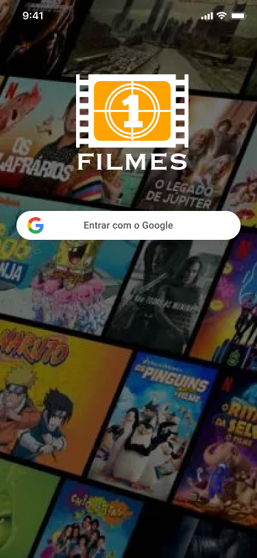
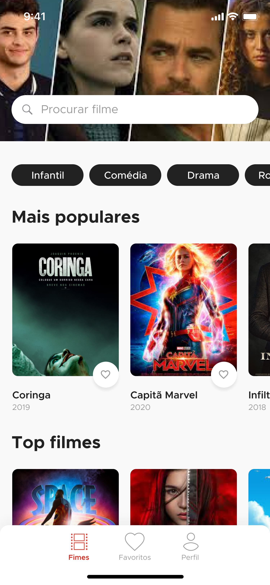
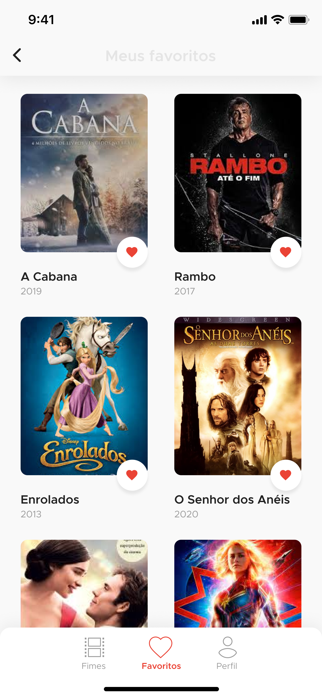
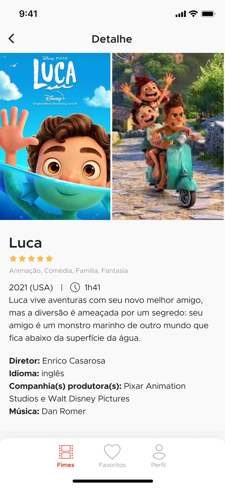

# Dart Week

Projeto desenvolvido na Dart Week - 4ª Edição - Disponibilizado pela Academia do Flutter.
- [Academia do Flutter](http://academiadoflutter.com.br/)
- [Protótipo no Figma](https://www.figma.com/file/uxIIdBQowPYx5KS9nGHS4A/Filmes?node-id=0%3A1)

# Descrição

    
    
    
    

- [Lab: Write your first Flutter app](https://flutter.dev/docs/get-started/codelab)
- [Cookbook: Useful Flutter samples](https://flutter.dev/docs/cookbook)

## Desenvolvimento:
- [x] Tela Splash.
- [x] Tela Login.
- [] Tela de Filmes.
- [] Tela de Favoritos.

## Aprendizado:
* Dart `null safety`.
* Utilização de `GetX` para gerencia de estado.
* Utilização de Autenticação com `Firebase - Authentication`.
* Utilização de conceitos `SOLID`.
* `Mixin` para adicionar métodos a classes de forma 'isolada' e permitir que somente algumas classes possuam tal comportamento.
* `extension` para adicionar comportamentos a classes.
* Heranças múltiplas com `with`.
* Compenentização.
* Orientação a Objetos.
* Utilização do `Figma` para o protótipo.